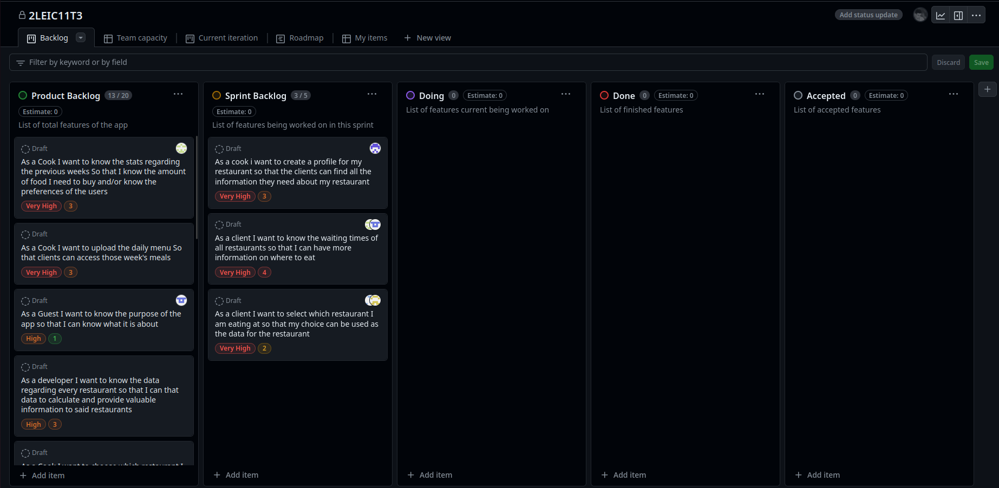
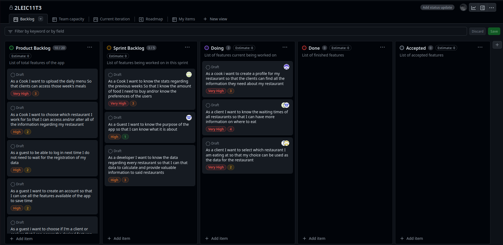
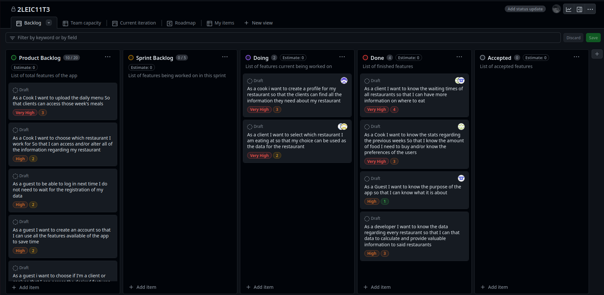
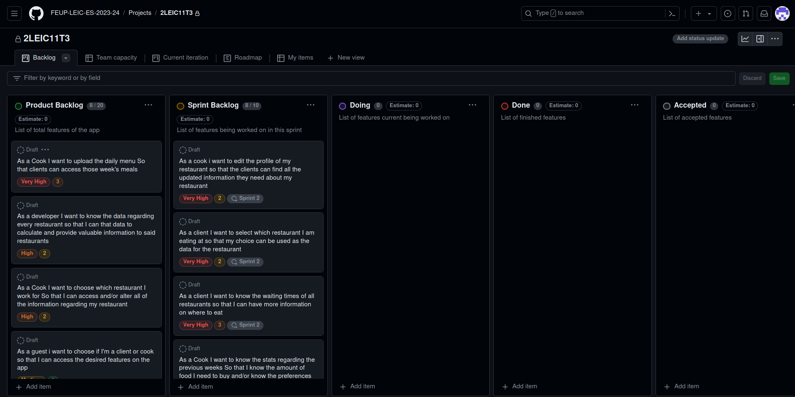
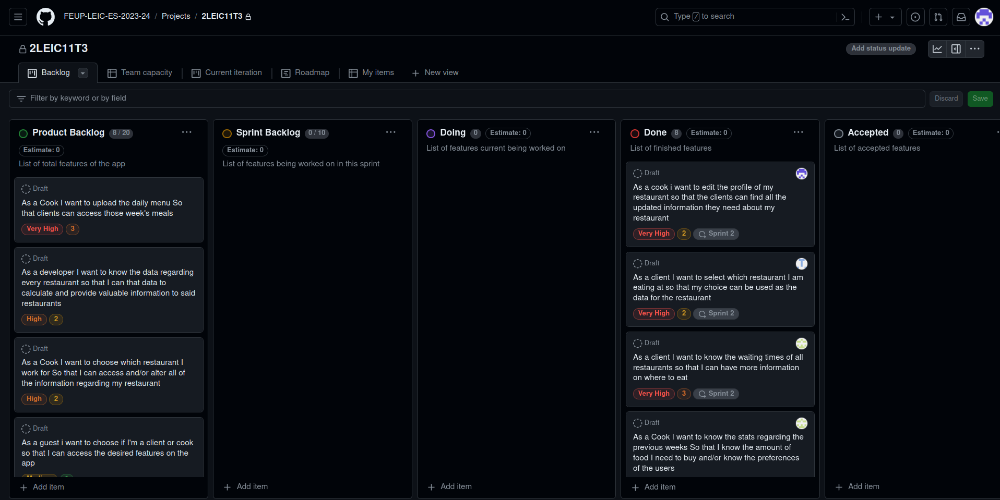
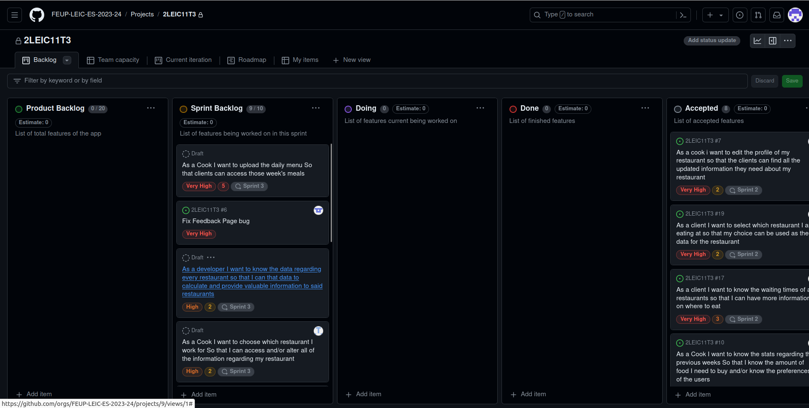
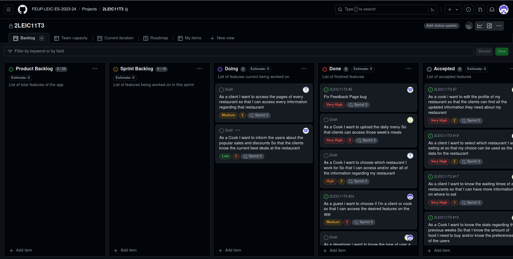

# BiteQ Development Report

* [Business modeling](#Business-Modelling) 
  * [Product Vision](#Product-Vision)
  * [Features](#Features)
  * [Assumptions and dependencies](#Assumptions-and-dependencies)
  * [Elevator Pitch](#Elevator-pitch)
* [Requirements](#Requirements)
  * [Domain model](#Domain-model)
* [Architecture and Design](#Architecture-And-Design)
  * [Vertical prototype](#Vertical-Prototype)
* [Project management](#Project-Management)
  * [Sprint 1](#Sprint-1)
  * [Sprint 2](#Sprint-2)
  * [Sprint 3](#Sprint-3)

Guilherme Teixeira -> up202204875@up.pt

Júlio Santos -> up202207975@up.pt

Gabriel Sousa -> up202108816@up.pt

Project Grade: 16.3

---
## Business Modelling

### Product Vision

#### Vision Statement
_**"An option that'll save time and food for everybody."**_

### Features
* Sign in - A guest is able to sign in and register into the database as a client or cook (if it is a cook it must choose what restaurant is it part of)

* Log in - A client and/or cook must be able to enter the app using only their email and password, skipping the signing process

* Restaurant choice - In the home page, besides displaying a mini version of every restaurants main page, the client will also be able to select which restaurant was his choice during that specific day, contributing not only for the data of the restaurant, but also influencing the feedback section of the app.

* Restaurant pages - Each cook must have the right to create and/or alter their restaurant main page. Similarly, each client must be able to access any main page available and check each of the sub parts of that page, such as:
  - Menu - Each page must have a sub part called "Menu", which will display a calender where, by clicking on each day, will display the planned meals for that day, along with nutritional and allergic informations. Every cook can add the planned meals for a specific day, by clicking on that day, then clicking on add meal, and finally by filling all of the necessary information and saving the changes.
  - Promotions - Such as with the menu, the promotions sub part will also display a calender displaying the available promotions and deals for each day. Similarly, the cooks will also be able to add said informations when necessary.
  - Waiting times - Every restaurant will have an approximate waiting time atributed by the app, using the data available by the restaurants to make estimates based on previous attendance and average time spent by customer ordering. Besides being available as a sub part of the restaurants page, it also be available as a separate part of the app.

* Waiting times - Alongside each restaurant showing its own waiting time, they will also be shown in a separate division of the app, alongside all of the other restaurants waiting times, and accompanied by a list of suggested choices, based on a waiting time times price ratio

* Statistics - This a feature available only for cooks, and it will display graphs of both attendance and satisfaction regarding a specific week of the restaurant. In the future, we plan to have other statistics such as the possibility to analise the data by month/year, giving the restaurants a more compreensive way of understanding the state of their business, and more important, the amount of food necessary for each day.

* Feedback - This a feature available only for clients, where based on the choice of restaurant for that day, the client will be able to leave a positive or negative remark regarding their meal, alongside with an optional comment, which can be given in order for the restaurant to receive specific feedback.

For now we have this list of features presented, list which may be altered during the making of the app. 

### Assumptions and dependencies

At least one owner/worker from each restaurant has an account.

We have access to previous restaurant attendances.

The restaurant info alongside the menus are provided by each restaurant database

### Elevator Pitch
BiteQ is the perfect solution for the students and staff who are looking for the right place to eat their next meal. It keeps track of all the information about the restaurants that allows the costumer to make the right choice when it comes to deciding where to have the next meal. It was inspired by the UN SDG, so that its main goal is to reduce the waste of food.

With that said, the cooks who produce the meals can also be users, which allows them to keep track of the amount of food that wasn’t eaten and edit the weekly menu. Other functionalities include being able to see the approximate waiting time in each eating place and see/write comments and reviews about those eating places, for example. 

This is what makes BiteQ the right choice if you want to eat your next meal knowing no food is wasted.

## Requirements
### Domain model

 

  

In this app, the user starts as a guest, being able to turn into a client or cook, depending on the type, after sign in. Both are able to log in the app and have all of the guest's atributes plus a distinct id. The cook is able to create a restaurant page. That restaurant page is subdivided into the menu page, the promotions page, the waiting time page, the statistics page (only acessible by cooks) and the feedback page. The menu page contains a calendar which contains meals for each day (each of them with a type, calories, and if they are gluten and/or lactose free or not). The promotions page also includes a calendar with the planned promotions for the day. The waiting time page, contains all of the waiting times and a list of restaurants ordered by waiting time times price ratio (which is created by the developer). The statistics page takes the restaurant choices and the feedback of the clients to give attendance and satisfaction data to the cooks. The feedback page is used by the clients to give feedback by simply liking or disliking the food, with the optional choice of writing a review.

## Architecture and Design
As we have yet to develop any code outside of the vertical prototype, there is no architectural and design problems to be noted so far.

### Vertical prototype
For our vertical prototype we decided to implement the sign in feature of our app, by building a page with the title "Sign in", email and password slots which can be filled by the user, and finally two buttons simbolizing the two types of users available (client and cook).

While very simple, it still shows the use of statefull widgets, since that was the way we found to implement the ability of the client and/or cook buttons turning grey if pressed.

  

## Project management
### Sprint 0
As this is still sprint 0, we have no sprint planning or release management done already.
However, we already have our user stories distributed in our Github Projects board, whose link will be right here. [Github Projects board](https://github.com/orgs/FEUP-LEIC-ES-2023-24/projects/9);

Release Management: [v0](https://github.com/FEUP-LEIC-ES-2023-24/2LEIC11T3/releases/tag/Sprint_0)

### Sprint 1
After the initial sprint planing, our board looked like this:

Then, after some added discussions, our board looked like this:

In the end, it ended like this:

Release Management: [v1](https://github.com/FEUP-LEIC-ES-2023-24/2LEIC11T3/releases/tag/Sprint_1)

* Sprint Retrospective
  - What went well? - Most user stories were completed, although with some defect, and we believe our estimation of effort on the tasks and distribution of tasks between the team was well done.
  - What to do differently? - Our main improvements rely on the time management, which can and will be greatly improved for next sprint. Besides that, we believe our sprint planning could also use soe help, as our selection of user stories into the sprint backlog wasn't the most optimal. Finally, although that isn't really an improvable topic, there were some hickups with members of the group during this sprint that we hope to avoid futurally.
  - Puzzles - There aren't really any topics that haven't already made the list that we believe should

Said this, our main changes will be:
  - Start meeting once a week to discuss about the evolution of the sprint (besides the weekly class)
  - Update our changes directly into the ESOF repository after ready (we tried using a separate repository for this and it just further complicated things)

### Sprint 2
After the initial sprint planning, our board looked like this

There were no increments in this sprint, so our board looked like this in the end of the sprint

Release Management: [v2](https://github.com/FEUP-LEIC-ES-2023-24/2LEIC11T3/releases/tag/Sprint_2)

* Product Increment
  - In this sprint, we had a slight change in the product backlog, as the user story ("As a cook, I want to create a profile for my restaurant so that the clients can find all the information they need about a restaurant") was changed to ("As a cook i want to edit the profile of my restaurant so that the clients can find all the updated information they need about my restaurant"). Our reason for this is that a cook has to select a predetermined restaurant to sign up to the app. Therefore, we thought it was a better idea to have preformed profiles for the restaurant in the app, and then let the cooks change the information inside from name to image to menus, etc...

* Sprint Retrospective
  - What went well? - All user stories were complete, and this time with a real connection to the database.
  - What to do differently? - Task distribution must be improved for next sprint, as there were members that contributed way more than others to the app. Besides that, our overall design of the app needs big improvements, as our main focus yet has been functionality.
  - Puzzles - We applied the weekly meetings we suggested last sprint, and as we believe they worked we will keep them for next sprints.
 
Said this, our main change will be:
  - Distributed the workload more evenly in order to not overflow any member of the group with work.
  - Puzzles - There aren't really any topics that haven't already made the list that we believe should

### Sprint 3
After the initial sprint planning, our board looked like this

There were no increments in this sprint, so our board looked like this in the end of the sprint

Release Management: [v3](https://github.com/FEUP-LEIC-ES-2023-24/2LEIC11T3/releases/tag/Sprint_3)

* Product Increment
  - In this last sprint, we still had quite a few features to implement, some of them being essential features in the app. The calendar offered the most difficulties, as it required the use of an API for the first time in this project. Besides that, it also required a lot of database rearanging in order to correctly display the data to the clients, and allow the cooks to add meals. Besides that, we were able to display the profile information of the user, which was not hard, but was just laying around. Also, we divided the app between cooks and clients, so that finally each information gets directed to the correct type of user. In the end, we got a functional app that does exactly what we intended it to do. However, there were a lot of setbacks, and many user stories, although achieved, are way underdeveloped for what we had invisioned in the mockups/user stories. To sum up, this last sprint made us apreciate the final product achieved, while still making us want to improve futurally.

* Sprint Retrospective
  - What went well? - Our app made the best progress for one sprint to another in all of the sprints. While still not implementing everything, our app does the main goals we set it to do.
  - What to do differently? - Our communication was pretty weak this sprint, which lead to the 2 missed user stories
 
Said this, our main change will be:
  - Distributed the workload more evenly in order to not overflow any member of the group with work.
  - Puzzles - There aren't really any topics that haven't already made the list that we believe should
